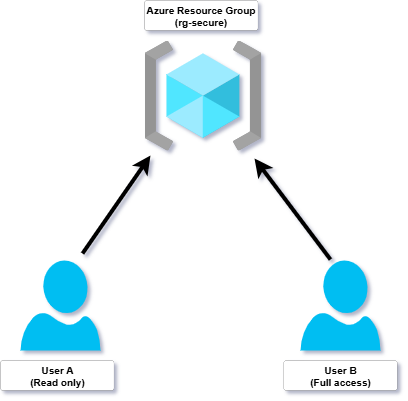

# Azure RBAC Role Assignment with Bicep

This project demonstrates how to automate **Azure Role-Based Access Control (RBAC)** assignments using **Bicep**, Azure’s native infrastructure-as-code (IaC) language. It provisions precise access permissions for users or service principals across Azure scopes (subscription, resource group, or individual resources).

The goal is to apply **security best practices** such as **least privilege** and **declarative access control**—concepts critical to both real-world cloud security and the **AZ-500: Microsoft Azure Security Technologies** certification.

---

## Why it matters

Manually assigning roles in the Azure Portal is error-prone and not scalable. This project shows how to:
- Replace manual steps with **version-controlled**, repeatable infrastructure
- Enforce secure access using **parameterized Bicep templates**
- Implement one of the core identity and access management (IAM) skills covered in the **AZ-500 exam**

---
## Technologies used

- **Bicep** – Azure’s DSL for deploying infrastructure as code
- **Azure Role-Based Access Control (RBAC)** – Built-in access control system
- **Azure Active Directory (AAD)** – Identity platform for assigning roles
- **Azure CLI** – To deploy and test Bicep templates
- **JSON Parameters File** – To input role definition IDs, principal IDs, and scopes

---

## Key security concepts covered

- **Least privilege access**  
- **Scoping RBAC correctly (subscription, RG, resource)**  
- **Infrastructure as Code (IaC) for access control**  
- **Declarative IAM policy management**

## Who is this for

This is ideal for:
- **Cloud Security Engineers** learning automation
- **DevSecOps professionals** enforcing policy-as-code
- **AZ-500 certification candidates** needing hands-on practice

## 🧱 Architecture Diagram



---

## 📦 Project Structure

azure-rbac-configuration/
├── bicep/
│ └── rbac-role-assignment.bicep # Bicep template for RBAC configuration
├── images/
│ ├── rbac-diagram.png # Architecture diagram
│ └── .gitkeep # Placeholder to keep the folder in Git
├── scripts/
│ └── assign-role.ps1 # PowerShell script to deploy the Bicep template
├── .gitignore
├── LICENSE
└── README.md

---

## What This Project Does

- Automates **Azure RBAC role assignments** using Bicep
- Demonstrates use of **Infrastructure as Code (IaC)** for secure Azure resource access
- Assigns built-in roles (e.g., Reader, Contributor) to users or service principals
- Enforces **least privilege** principle in real-world Azure environments

---

## How to Deploy


> ⚠️ **Note**: This project was developed and tested using **Microsoft-provided Azure sandbox environments** through [Microsoft Learn On Demand](https://msle.learnondemand.net), as part of the **AZ-500 Microsoft Azure Security Technologies** course.  
> If you're using a personal Azure subscription, make sure you have permissions to assign roles and deploy resources.

### 1. Clone the Repository

```bash
git clone https://github.com/datieno9/azure-rbac-configuration.git
cd azure-rbac-configuration
```

```powershell
# Log in to Azure(if not already)
Connect-AzAccount

# Execute the deployment script
./scripts/assign-role.ps1
```

This will:

- Deploy the `rbac-role-assignment.bicep` template  
- Assign the specified role to a user or service principal  
- Use default or customized parameters for role, principal, and scope

---

## ✅ Learning Outcomes

By completing this lab, you will:

- Understand how to implement RBAC at different Azure scopes
- Gain experience using Bicep for declarative access control
- Practice deploying with PowerShell scripts in a secure, automated workflow
- Be better prepared for **AZ-500 certification scenarios**

---

## 📫 Contact

**Author:** [Ruth Daisy Atieno Otieno]  
**LinkedIn:** [linkedin.com/in/ruth-daizy-otieno-1a1a63273/](https://linkedin.com/in/ruth-daizy-otieno-1a1a63273/)  
**GitHub:** [github.com/datieno9](https://github.com/datieno9)

---

## License

This project is licensed under the [MIT License](./LICENSE).

